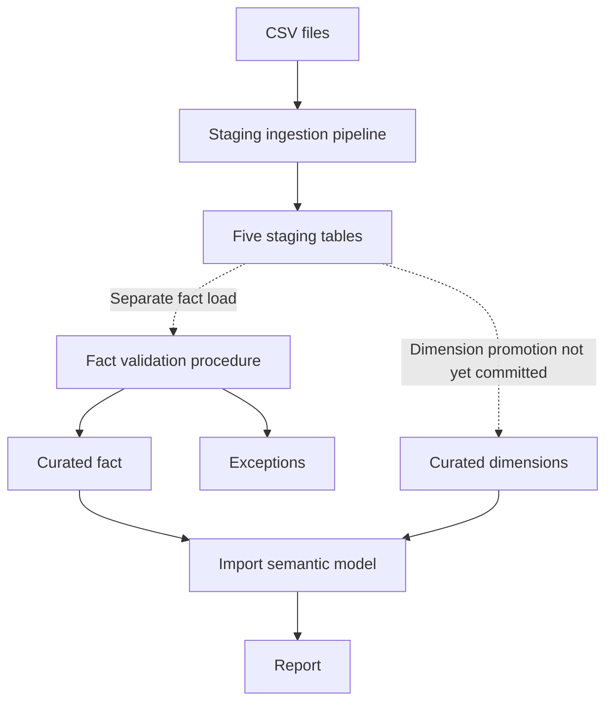

# Procurement Spend Governance & Analytics

**Power BI | Microsoft Fabric Warehouse | SQL | Row-Level Security | Controlled Deployment**

An independent Power BI and Microsoft Fabric portfolio demonstrating procurement reporting with SQL validation, exception handling, semantic modelling, row-level security testing and controlled deployment.

Built with synthetic data: **850 transactions, 12 suppliers and five departments**. This is portfolio evidence of implementation and testing, separate from my commercial Tableau and QlikView delivery.

## What a reviewer should know

- **Reporting:** spend against budget, supplier concentration, purchase-order coverage and contract-expiry analysis.
- **Data quality:** staged fact rows are validated before loading; rejected rows retain an explicit exception reason.
- **Security:** dynamic department access in the main semantic model, plus a separate SQL-RLS/Direct Lake experiment that exposed and addressed a fact-table access gap.
- **Delivery:** Dev/Test/Prod report and semantic-model promotion, with documented definitions and handover information.
- **Ingestion:** five Copy activities load staging tables; repeated full runs retained stable row counts and unique keys.

The project demonstrates these practices on a small dataset. Current automation and security boundaries are documented in **Scope and limitations** below.

## Implementation at a glance

| Area | Evidence |
|---|---|
| Fabric Warehouse | Staging and curated schemas; individual SQL objects committed in the Warehouse database project |
| Semantic modelling | One fact table, four analytical dimensions, a security mapping table and single-direction relationships |
| Measures | Dedicated `_Measures` table with documented calculation intent |
| Validation | `curated.usp_LoadFactSpend`: type, required-field, dimension-key and duplicate-ID checks; rejected rows written to `Fact_Spend_Exceptions` |
| Reconciliation | `curated.usp_ReconcileSpendTotals` returns counts, spend totals and quality counts for manual review |
| Ingestion | `Procurement_Full_Refresh.DataPipeline/pipeline-content.json`: five Copy activities, each with a staging-table pre-copy deletion |
| Access controls | Dynamic `Own Department` and illustrative static `Finance` model roles; committed SQL security predicate and policies for the separate experiment |
| Deployment | Native Fabric Dev/Test/Prod deployment pipeline for the report and semantic model |
| Version control | Warehouse, main semantic model, report and staging ingestion pipeline stored in Git |

<strong>Business questions and report pages</strong>

The report supports three recurring questions:

1. **Financial position:** where is spend above or below budget, and how is it changing?
2. **Supplier exposure:** which suppliers account for a material share of spend or have contracts approaching expiry?
3. **Reporting controls:** what definitions, access rules and assumptions sit behind the numbers?

### Executive Overview

Total Spend, Budget Variance, % Budget Variance and Spend vs Prior Year, supported by period and department comparisons.

In the synthetic 2024 data, the full-year position is 5.1% under budget (GBP 305K favourable). Year and Division filters support further exploration.

### Supplier Analysis

Spend and concentration charts sit alongside a supplier table covering contract status, expiry, PO coverage and budget variance.

`fn_ContractStatus` classifies suppliers as Inactive, Near Expiry or Secure as of a supplied date. The report uses `vw_ContractStatus_Current`, merged into `Dim_Supplier` through Power Query.

### Governance Notes

An in-report page explains measure definitions, security, deployment and illustrative thresholds:

- PO coverage below 80%.
- Budget variance above GBP 10,000 overspend.
- Active contracts expiring within 12 months classified as Near Expiry.

These are portfolio assumptions, not agreed organisational policies.

<strong>Data ingestion, validation and test results</strong>

### Staging ingestion

Source CSV files are accessed through a gateway. `Procurement_Full_Refresh` contains five independent Copy activities. Each deletes its own staging destination before inserting the source rows.

Cost Category now lands in `stg.Dim_CostCategory_Raw` rather than being copied directly into curated. Its staging table retains the types cloned from the curated table; the other staging tables retain their existing raw-input schemas.

Two consecutive full pipeline runs on **5 October 2026** retained these counts. In each table, total rows equalled distinct keys:

| Staging table | Rows / distinct keys |
|---|---:|
| `Fact_Spend_Raw` | 850 |
| `Dim_Date_Raw` | 731 |
| `Dim_Department_Raw` | 5 |
| `Dim_Supplier_Raw` | 12 |
| `Dim_CostCategory_Raw` | 6 |

This replaced the earlier Append-based full-copy approach, which had accumulated duplicate staging rows. `CopyJob_1` remains in the repository as an earlier artefact.

### Fact validation

`curated.usp_LoadFactSpend` checks staged records and routes accepted rows into `curated.Fact_Spend`. Rejected rows are retained in `curated.Fact_Spend_Exceptions` with a reason and timestamp.

The procedure explicitly checks missing `POFlag` and missing or non-numeric `BudgetAmount`. Curated fact deletion and insertion run in a transaction; exception inserts occur before that transaction.

| Targeted test | Observed result |
|---|---|
| Original bad-date/unknown-supplier test | Test record routed to the exception table |
| Null `POFlag` | Test record quarantined and excluded from curated fact |
| Non-numeric `BudgetAmount` | Test record quarantined and excluded from curated fact |
| Clean reload after removing the two later test records | Unfiltered curated fact count returned to 850 under controlled loading conditions |

The two later validation cases were checked on **4 October 2026**. SQL security policies were temporarily disabled for the controlled reload and restored afterwards. These are targeted checks, not a comprehensive test suite.

### Warehouse design

A Warehouse was chosen to support T-SQL data modification during loading. Staging separates incoming records from the curated analytical tables read by the report semantic model.

Declared `PRIMARY KEY` and `FOREIGN KEY ... NOT ENFORCED` constraints document the intended relationships. They do not validate integrity at write time.

`usp_ReconcileSpendTotals(@AsOfDate)` returns transaction counts, spend totals and quality counts for manual comparison before deployment.

<strong>Semantic model and analytical measures</strong>

The model has one transaction-level fact table, four analytical dimensions and one security mapping table.

| Table | Purpose |
|---|---|
| `df_clean_spend` | Spend, allocated budget and purchase-order status |
| `Dim_Date` | Calendar and fiscal period filtering |
| `Dim_Supplier` | Supplier attributes, status and contract information |
| `Dim_Department` | Department, division, location and cost-centre attributes |
| `Dim_CostCategory` | Cost category, spend type and budget type |
| `Dim_UserDepartmentMap` | User-to-department mapping for dynamic access |

Single-direction relationships keep filter behaviour predictable. Measures are centralised in `_Measures`.

| Measure | DAX Pattern | Purpose |
|---|---|---|
| `Total Spend` | `SUM(InvoiceAmount)` | Base measure - total invoice value in the current filter |
| `Total Budget` | `SUM(BudgetAmount)` | Budget allocation in the current filter |
| `Budget Variance` | `[Total Spend] - [Total Budget]` | Absolute variance - positive means overspend |
| `% Budget Variance` | `DIVIDE([Budget Variance], [Total Budget])` | Variance as a percentage, for comparing across departments |
| `PO Coverage Rate` | `DIVIDE(COUNTROWS(FILTER(df_clean_spend, df_clean_spend[POFlag] = "Yes")), COUNTROWS(df_clean_spend), 0)` | Share of transactions with a purchase order - flagged in the report below the illustrative 80% threshold |
| `Supplier Concentration %` | `DIVIDE([Total Spend], CALCULATE([Total Spend], ALL(Dim_Supplier)))` | Each supplier's share of spend after removing supplier-table filters, while retaining the surrounding date, department and other model context |
| `Top 2 Supplier Concentration` | `DIVIDE(SUMX(TOPN(2, VALUES(Dim_Supplier[SupplierKey]), [Total Spend], DESC), [Total Spend]), CALCULATE([Total Spend], ALL(Dim_Supplier)))` | Combined share of the two biggest suppliers, on the same all-supplier basis as above |
| `Spend vs Prior Year` | `DIVIDE([Total Spend] - CALCULATE([Total Spend], SAMEPERIODLASTYEAR(Dim_Date[FullDate])), CALCULATE([Total Spend], SAMEPERIODLASTYEAR(Dim_Date[FullDate])))` | Year-over-year change as a percentage - responds to the year, department and division filters |

**Interpretation:** the supplier-concentration denominator removes supplier-table filters while retaining the surrounding model context. The Supplier Analysis charts display active suppliers, but their concentration percentages remain shares of total spend, including inactive suppliers.

Budget amounts are allocations distributed across transactions, rather than a separate budget fact table.

<strong>Row-level security and Direct Lake testing</strong>

### Main semantic-model roles

| Role | Rule | Intended scope |
|---|---|---|
| `Own Department` | User mapping filtered with `USERPRINCIPALNAME()` | Mapped department |
| `Finance` | `Dim_Supplier[Status] = "Active"` | All departments, active suppliers |

Roles were checked using Desktop View As Role and Service Test as role. The Finance supplier count changed from 12 to nine, matching the three inactive suppliers.

The Finance role illustrates a static filtering pattern; it is not a recommended production finance/audit access design. Historical supplier visibility would need to follow actual business requirements.

### Separate SQL-RLS experiment

An additional **Direct Lake on SQL** semantic model was used to test refresh behaviour and SQL-endpoint security alongside the main Import model.

Applying a department predicate to `curated.Dim_Department` alone filtered the dimension but left direct access to `curated.Fact_Spend` exposed. A visual showed an unlabelled total for other departments, and a direct fact query returned all five departments.

The same predicate was then applied to the fact table. The retested visual showed only the mapped IT department, without the unlabelled total.

Committed Warehouse objects include:

- `Security/Functions/fn_DepartmentPredicate.sql`
- `Security/Security/DepartmentFilter.sql`
- `Security/Security/FactSpendFilter.sql`
- `curated/Tables/Dim_UserDepartmentMap.sql`

The mapping-table definition does not populate user assignments.

Performance Analyzer showed 170ms of Direct query time alongside 249ms of DAX query time for the tested visual, consistent with DirectQuery fallback in this SQL-RLS scenario.

### Refresh comparison

| Mode | Observed refresh duration |
|---|---:|
| Direct Lake framing | 1 second |
| Import | 22 seconds |

These observations describe this small test model. They are not an enterprise-scale performance benchmark or comprehensive security certification.

<strong>Deployment and current data flow</strong>

### Report and semantic-model promotion

| Stage | Workspace | Implementation |
|---|---|---|
| Dev | `Procurement-Spend-DEV` | Warehouse, staging ingestion pipeline, main semantic model and report |
| Test | `Procurement-Spend-TEST` | Report and semantic model connected to the Dev Warehouse; refresh and role checks performed |
| Prod | `Procurement-Spend-PROD` | Report and semantic model connected to the Dev Warehouse; model endorsed as Promoted |

Fabric's native Deployment pipelines feature supports report and semantic-model promotion. This deployment pipeline is separate from the staging ingestion data pipeline.

### Current flow

The ingestion pipeline loads staging only. The fact procedure is executed separately; dimension promotion is not yet captured as committed SQL.

The existing lineage screenshot predates the replacement ingestion pipeline:

## Scope and limitations

- **Curated loading is separate.** The pipeline does not invoke `usp_LoadFactSpend`. All four dimensions still need a committed staging-to-curated promotion path.
- **SQL security and loading need separation.** The experimental SQL policies affect the loader's department lookups and fact deletion scope. Controlled recovery used temporary policy disabling followed by restoration. An appropriately authorised loading path remains unresolved; curated refresh is not scheduled or chained into the pipeline.
- **Staging replacement is not atomic.** Pre-copy deletion and insertion are separate operations. A failed copy can leave staging empty or partially loaded. Repeat-run checks did not test overlapping runs.
- **Exception history appends.** Repeated procedure execution can append the same rejected records again. Reconciliation returns values for manual comparison, not an automatic source-to-curated pass/fail result.
- **Environment data is shared.** Test and Prod use the Dev Warehouse; the project demonstrates artifact promotion rather than isolated data environments.
- **Security tests are limited.** The documented department scenario uses one authorised identity. Separate unmapped-user and cross-department denial cases are not documented. The main model's user mapping is manually entered; the Warehouse mapping is used by the SQL-RLS experiment.
- **Operation remains manual.** Sources are local CSVs accessed through a gateway; monitoring, alerting and scheduled report refresh are not implemented.
- **Evidence is portfolio-scale.** The dataset is small and synthetic. The additional Direct Lake model was excluded from the 5 October repair commit, and existing screenshots may show earlier states where identified.

## Next priorities

1. Separate SQL reporting security from an authorised loading path.
2. Commit dimension promotion and orchestrate validated staging-to-curated loading.
3. Add explicit reconciliation outcomes and broader positive/negative security tests.
4. Add scheduling and monitoring once those foundations are verified.

---

[Nishant Goel on LinkedIn](https://linkedin.com/in/nish-goel) | [GitHub](https://github.com/nishantgoeluk-pixel)

